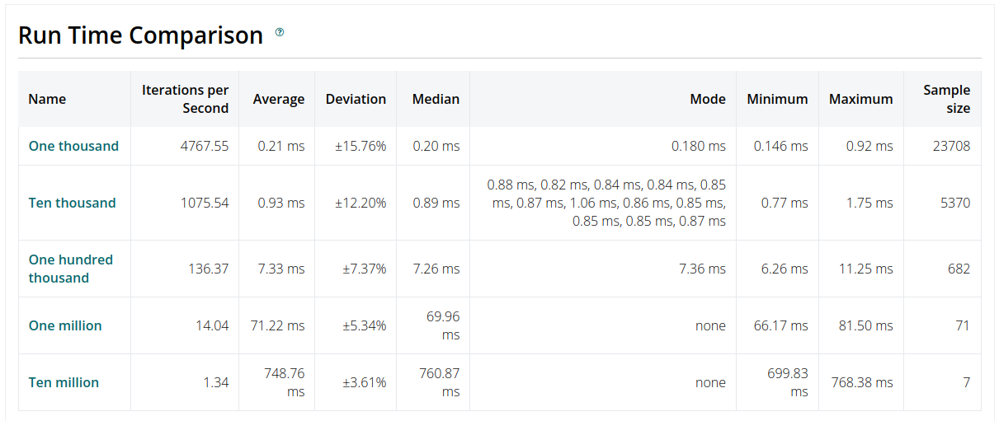
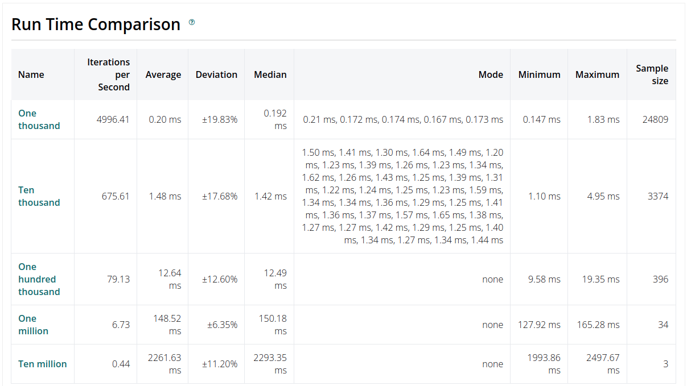

# Sieve of Eratosthenes

Implementation of sieve of eratosthenes algorithm to calculate all the prime numbers until number given used as limit, using tail recursive optimization and async functions.

How it works is:
* Create a list of numbers between two and the input parameter like this `[2..input]`
* Get the square root to chunk the list generated
* Calculate all the primes of the first list
* Remove al composite numbers of the remaining lists
* Return all the prime numbers not filtered by the prime numbers and the firs list of prime numbers

## Installation

If [available in Hex](https://hex.pm/docs/publish), the package can be installed
by adding `sieve_of_eratosthenes` to your list of dependencies in `mix.exs`:

```elixir
def deps do
  [
    {:sieve_of_eratosthenes, "~> 0.1.0"}
  ]
end
```

## Usage
For calculate all the primes with a limit given you can call the module `SieveOfEratosthenes.calculate_primes/1` like this.
```elixir
iex> SieveOfEratosthenes.calculate_primes(1_000)
[2, 3, 5, 7, 11, 13, 17, 19, 23, 29, 31, 37, 41, 43, 47, 53, 59, 61, 67, 71, 73,
 79, 83, 89, 97, 101, 103, 107, 109, 113, 127, 131, 137, 139, 149, 151, 157,
 163, 167, 173, 179, 181, 191, 193, 197, 199, 211, 223, 227, 229, ...]
```

## Benchmark for v0.2.0
The benchmark was generated with Benchee shown the following results:



## Benchmark for v0.1.1
The benchmark was generated with Benchee shown the following results:



To run the benchmarks again, just run `mix run benchmarks/calculate_primes.ex` and see the results on `benchmarks/results/index.html`

## Maintainer
This proyect was developed by [José Juan García](https://github.com/Freakisimo) in my track to become a elixir developer

## Contributing
Feel free to recommend any change in favor of improving this project

Documentation can be generated with [ExDoc](https://github.com/elixir-lang/ex_doc)
and published on [HexDocs](https://hexdocs.pm). Once published, the docs can
be found at [https://hexdocs.pm/sieve_of_eratosthenes](https://hexdocs.pm/sieve_of_eratosthenes).

