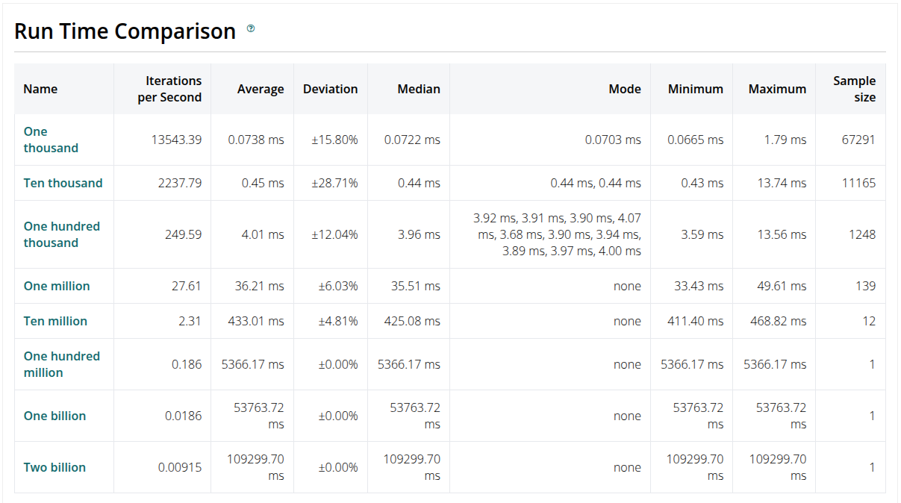
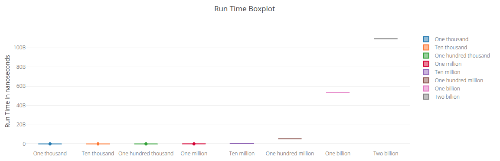
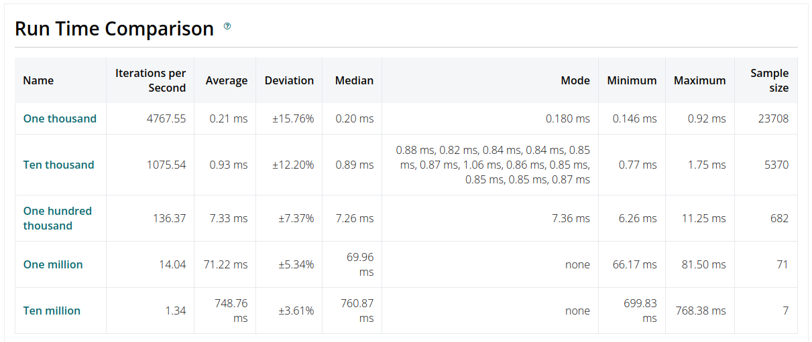
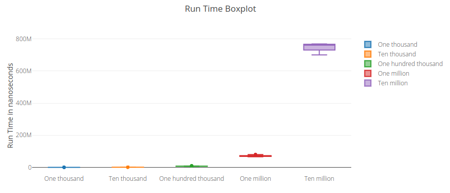
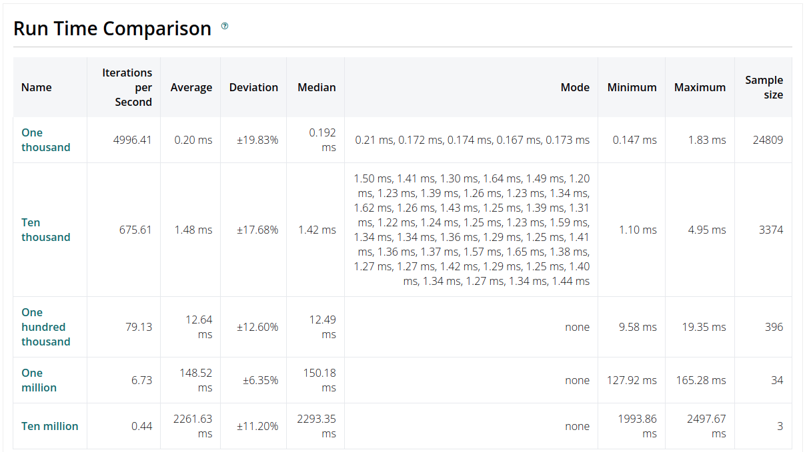
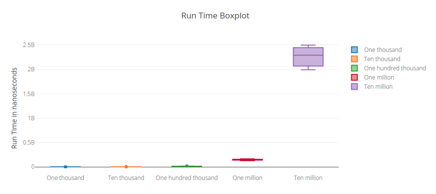

# Sieve of Eratosthenes

Implementation of sieve of eratosthenes algorithm to calculate all the prime numbers until number given used as limit, using `:atomics` for O(1) access and concurrent marking.

How it works is:
* Create an `:atomics` array of size `input + 1` where index = number (0 = prime, 1 = composite)
* Find small primes up to `√input` sequentially
* Mark all multiples of each small prime concurrently using `Task.async` (lock-free writes)
* Collect all indices still marked as prime

## Installation

If [available in Hex](https://hex.pm/docs/publish), the package can be installed
by adding `sieve_of_eratosthenes` to your list of dependencies in `mix.exs`:

```elixir
def deps do
  [
    {:sieve_of_eratosthenes, "~> 0.3.0"}
  ]
end
```

## Usage
For calculate all the primes with a limit given you can call the module `SieveOfEratosthenes.calculate_primes/1` like this.
```elixir
iex> SieveOfEratosthenes.calculate_primes(1_000)
[2, 3, 5, 7, 11, 13, 17, 19, 23, 29, 31, 37, 41, 43, 47, 53, 59, 61, 67, 71, 73,
 79, 83, 89, 97, 101, 103, 107, 109, 113, 127, 131, 137, 139, 149, 151, 157,
 163, 167, 173, 179, 181, 191, 193, 197, 199, 211, 223, 227, 229, ...]
```

## Benchmarks
To run the benchmarks, just run `mix run benchmarks/calculate_primes.ex` and see the results on `benchmarks/results/index.html`

### v0.3.0 (:atomics)
Rewritten using `:atomics` for O(1) access with concurrent marking. Enables 100M+ calculation.




### v0.2.0 (Streams + Tasks)




### v0.1.1




## Maintainer
This project was developed by [José Juan García](https://github.com/Freakisimo) in my track to become a elixir developer

## Contributing
Feel free to recommend any change in favor of improving this project

Documentation can be generated with [ExDoc](https://github.com/elixir-lang/ex_doc)
and published on [HexDocs](https://hexdocs.pm). Once published, the docs can
be found at [https://hexdocs.pm/sieve_of_eratosthenes](https://hexdocs.pm/sieve_of_eratosthenes).

